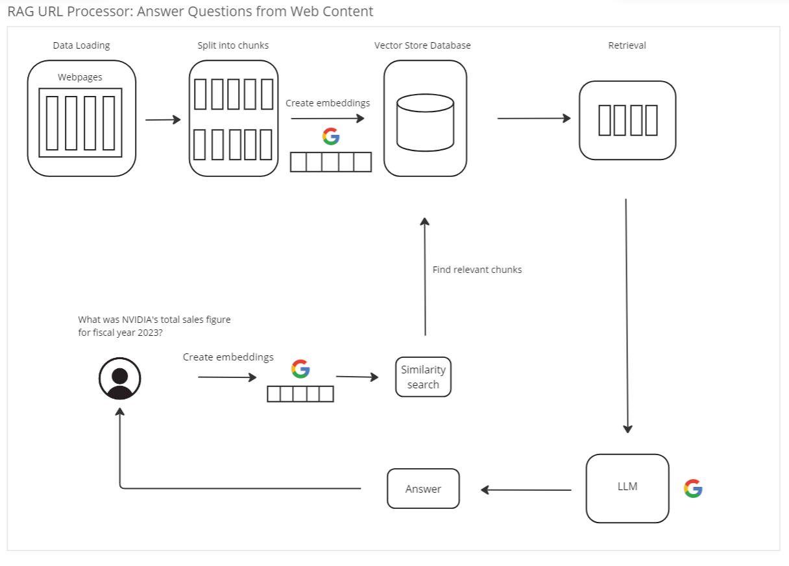

# RAG URL Reader Application
This RAG URL Reader is an application designed to load data from URLs and generate answers based on the provided 
context using Large Language Models (LLMs). This application is intended to offer users contextually appropriate 
responses to their inputs, aiding in information retrieval and facilitating smoother interaction within the 
given context. It serves as a complement to the concepts discussed in the accompanying 
[YouTube video](https://www.youtube.com/channel/UCYZ_si4TG801SAuLrNl-v-g), offering a practical implementation 
of the discussed techniques.
 

# Technology Used
- Python: Programming language used for development.
- Streamlit: Frontend framework for creating interactive web applications.
- Langchain: Utilized for language model integration.
- Google PaLM Embeddings: Transform texts to embeddings.
- Google PaLM and Gemini Pro: Large Language Models used for generating context-based responses.
- FAISS: Vector database for storing and querying embeddings efficiently.

# Features
- Load data from URLs.
- Generate embeddings and store them in a vector database such as FAISS.
- Utilize Large Language Models from Google to generate answers based on the context.
 
# Installation
To install the RAG URL Reader application, follow these steps:

Clone the repository:

    git clone https://github.com/Eduardovasquezn/rag-url-reader.git

Navigate to the project directory:

    cd rag-url-reader

Create and activate virtual environment:

    python -m venv venv
    venv/Scripts/activate

Install the required Python libraries:

    pip install -r requirements.txt

# Usage 

Create a `.env` file using `.env-example` as a template:

    cp .env-example .env

In the `.env` file, insert your [Google API Key](https://aistudio.google.com/app/apikey):

    GOOGLE_API_KEY=your_google_api_key

Run the main application script:

    streamlit run src/app.py

 
# Contribution
Contributions to this project are welcome! Feel free to submit bug reports, feature requests, or pull 
requests to help improve the functionality and usability of the RAG URL Reader application.

# Disclaimer
This application is intended for educational and informational purposes only. 

# Enjoyed Using RAG URL Reader? Subscribe to My Channel!
If you found the RAG URL Reader helpful and enjoyed using it, consider subscribing to my 
[YouTube channel](https://www.youtube.com/channel/UCYZ_si4TG801SAuLrNl-v-g?sub_confirmation=1) for more tutorials, 
tips, and projects related to Python, AI, and web development. Your support helps me create more valuable content 
for the community!